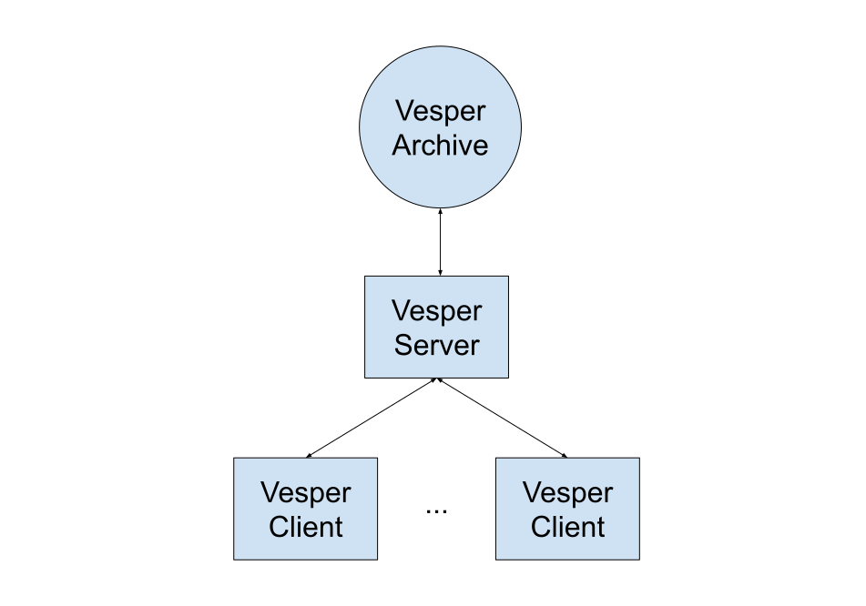
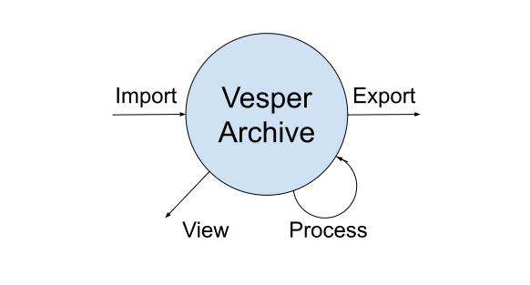
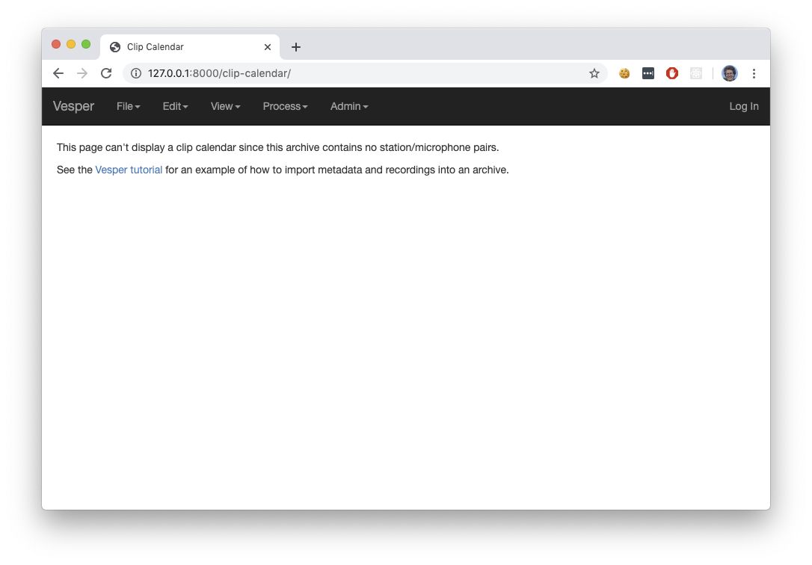
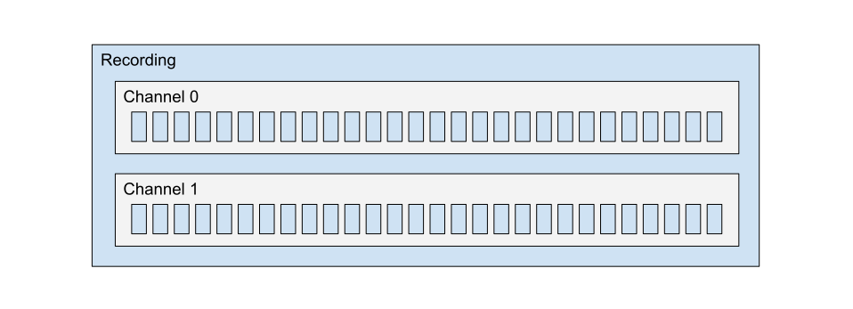
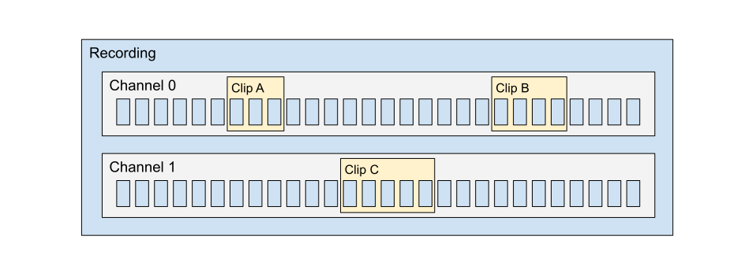

********
Tutorial
********

Welcome to the Vesper tutorial! In this tutorial, you will create
a new Vesper archive (don’t worry if you don't know that that is:
we’ll explain in a moment), import an audio recording into it, and
process the recording to find and classify some bird calls that
are in it. The tutorial will introduce several Vesper concepts
(like what an archive is) as needed, with just enough explanation
for the tutorial to make sense. The concepts will be explained in
more detail in other parts of the documentation.

Background
==========

Before we begin the tutorial proper, this section will provide a
little background about Vesper: how the Vesper application is
structured, the kinds of data (audio and other) that it processes,
and the kinds of processing that it can perform.

Vesper is a
`web application <https://en.wikipedia.org/wiki/Web_application>`_,
and as such comprises two main components, a *server* and a
*client*. The server provides access to a collection of data called
a *Vesper archive* (or just *archive* for short) to one or more
clients, and performs operations on the data on behalf of the
clients. As a picture, this application architecture looks like
this:

   
   The architecture of the Vesper web application.
   
The server typically runs on the computer that holds the archive.
Each client runs in a web browser, either on the same computer as
the server or on a different one. In this tutorial, we will run
the server and a single client on the same computer.

A Vesper archive is a collection of audio recordings and related
metadata. Each archive has its own directory on disk, called the
*archive directory*. The archive directory always contains
certain essential parts of an archive, and in many cases the
entirety of the archive.

Vesper supports various operations on archive data. The
operations that you will perform in this tutorial fall into four
broad and common categories. These categories are illustrated in
the following figure:

   
   Four common types of operations on Vesper archive data.

An *import* operation imports audio recordings and/or related
metadata into an archive from an external source. For example,
in this tutorial you’ll exercise two different kinds of import
operations, one for audio recordings and another for metadata
pertaining to them.

A *view* operation creates some sort of graphical representation of
data for you to view and in some cases interact with, for example
a spectrogram or a chart.

A *process* operation processes data, for example by running an
automatic detector or classifier, or by classifying a set of short
audio clips according to a key that you type on your keyboard.

Finally, an *export* operation exports data from an archive to an
external destination. For example, in this tutorial you’ll export
detected bird calls from your archive as audio files.

Getting started
===============

Now that you're somewhat oriented to the Vesper web application
and Vesper archives, let's get started with the actual tutorial!
In this first part of the tutorial, you will create a new Vesper
archive, add a user to it, start a Vesper server to serve the
archive, and run the Vesper client in a web browser to view the
archive.

Download the Vesper archive template
------------------------------------

#. The Vesper project provides an archive template that you can copy
   to serve as a starting point for a new archive. Download the archive
   template to your computer by clicking `here
   <https://www.dropbox.com/s/4gdgqj10ksh5w3f/Vesper%20Archive%20Template.zip?dl=1>`_
   .

#. The template is packaged as a zip file: unzip it. This should yield a
   directory called ``Vesper Archive Template``.

Create a new Vesper archive
---------------------------

#. Copy the ``Vesper Archive Template`` directory to serve as your new
   archive directory. You can name the new archive directory whatever
   you want, for example ``Tutorial Archive``.
   
#. Open a Windows Anaconda Prompt or Unix terminal and activate your
   Vesper conda environment with a command like::

      conda activate vesper-x.y.z
      
   but with "vesper-x.y.z" replaced with the name of your Vesper
   environment. See the `Installation <installation.html>`_ section
   of this documentation for more about installation and conda
   environments.
      
#. In your Anaconda Prompt or terminal, cd to your new archive directory.
   For example, if you're on Windows and the archive
   directory path is ``C:\Users\Bailey\Desktop\Tutorial Archive``, the
   command is::
   
      cd "C:\Users\Bailey\Desktop\Tutorial Archive"
      
   An analogous command on macOS or Linux would look like::
   
      cd "/Users/Bailey/Desktop/Tutorial Archive"
   
#. Vesper stores the metadata of an archive in a relational database
   in the archive directory. The archive template doew not include
   such a database, however, so you have to create it. To create the
   database, issue the command::
   
      vesper_admin migrate
      
   This should create the SQLite database file
   ``Archive Database.sqlite`` in the archive directory.
      
#. Vesper keeps track of who makes what changes in an archive via the
   notion of a *user*. You can add any number of users to an archive,
   and you must log in as one of those users to be able to modify the
   archive. Every archive should have at least one *superuser*, a user
   with certain administrative privileges. Add a superuser to your
   archive database with the command::

      vesper_admin createsuperuser
      
   The command will prompt you for the superuser's name, email
   address, and password (twice). You can skip the email address if
   you wish. **Do not use a password that you really want to keep
   secret.** Communication between the Vesper client and server is
   currently unencrypted, so it is possible for someone eavesdropping
   on your client/server network traffic to see your password.

Start the Vesper server
-----------------------

In the Windows Anaconda prompt or Unix terminal of the last section,
issue the command::

   vesper_admin runserver
   
Some output from the server should appear in the terminal, indicating
that the server started.

View the archive
----------------

To run a Vesper client to view the archive:

#. Start a web browser. At this point we strongly recommend using Chrome,
   since Vesper is tested and used most extensively with it.
   
#. Go to the URL:

      127.0.0.1:8000
      
   This should produce a page that looks something like this:
   

   
   An empty Vesper archive.
   
Congratulations: you've created, served, and viewed your very own
Vesper archive! It doesn't contain any data yet, but you'll remedy
that soon.

Archive data
============

As mentioned above, A Vesper archive is a collection of audio
recordings and related metadata. In this section we will explain
in a little more detail what that means, describing the main types
of data in an archive and how they relate to each other.

Recordings, clips, and annotations
----------------------------------

First and most importantly, a *recording* is a continuous
audio recording. A recording has one or more *channels*, each
of which comprises a sequence of numbers called *samples*. Each
sample represents an (almost) instantaneous air pressure
measurement made with the aid of a microphone. In multichannel
recordings (that is, recordings with more than one channel), the
samples of different channels are most often recorded using
different microphones.

The following figure illustrates the relationship between a
recording, its channels, and their samples:

   
   A stereo recording, with two channels and their samples.
   The horizontal axis represents time, and each small blue box
   represents one sample. Note that the figure is only schematic,
   and that real recordings typically contain orders of magnitude
   more samples than shown.
   
The samples of a recording are collected at a fixed rate called
the *sample rate*. The most common sample rates used for audio
recording are in the tens of kilohertz. That is, samples are
collected tens of thousands of times per second.

All of the channels of a recording have the same number of
samples, and the corresponding samples of different channels
(that is, corresponding in the sense that each sample has the
same position in its channel's sample sequence) are collected
at the same instant.

In addition to samples, a recording includes *metadata* that
provide information *about* the recording (hence the "meta"
prefix). For example, the metadata include a recording's start
time and sample rate.

Aside from recordings, all of the other data in an archive help
to describe the contents of the recordings, and hence are also
metadata. In the remainder of this section, we will list and
describe several types of such metadata.

A *clip* is a continuous portion of one recording channel. A
clip is typically much shorter than the recording that contains
it, and it typically contains a single acoustic event of
interest, such as a bird call. The following figure illustrates
the relationship between a recording and some clips within it:
  

   
   A stereo recording and some clips within it. The
   horizontal dimension represents time, and each small blue
   box represents one sample. Note that the figure is only
   schematic, and that real recordings and clips typically
   contain orders of magnitude more samples than shown.
     
Note that, as shown in the figure, different clips may
have different durations, and each clip is confined to a
single recording channel.
   
An *annotation* provides one piece of information about a
particular clip, and has a name and a value. A
*classification* is an annotation that classifies the contents
of a clip. For example, classification annotation might have
the name "Classification" and a value like "Call" or "Noise".
  
Stations and devices
--------------------

A monitoring *station* is a location where recordings are
made, with a name and a fixed latitude, longitude, and
elevation. A station also has recording devices associated
with it, as described below.

A recording *device* is a piece of recording hardware, either
an audio *recorder* (for example, an autonomous recording unit,
a manually-operated field recorder, or a general-purpose
computer with audio recording capabilities) or a *microphone*.
When you build an archive, you tell Vesper what devices you
used to create the recordings of the archive, including which
devices were used at which stations during which time periods,
and which microphones were connected to which recorder inputs
during
which time periods. From this information Vesper infers which
microphone was used to record each channel of each recording.
This allows Vesper to support various useful archive queries,
for example to retrieve for display all of the clips with a
particular classification that were made with a particular
microphone at a particular station on a particular night.

Processors
----------

A *processor* is software that processes existing data to create
new data. Vesper currently offers two types of processors:
detectors and annotators. A *detector* processes each of the
channels of one or more recordings to create clips, for example
to mark portions of recordings that contain bird calls. An
*annotator* processes clips to create annotations. For example,
a *classifier* is a common type of annotator that creates
annotations that classify the contents of clips.
  
Summary
-------

There are many kinds of archive data, including some not
mentioned above. For quick reference, here's a table
summarizing those described in this section:

+----------------+-----------------------------------------------------------------+
| Data           | Description                                                     |
+================+=================================================================+
| Recording      | Continuous audio recording with one or more channels.           |
+----------------+-----------------------------------------------------------------+
| Channel        | One channel of a recording, a sequence of samples.              |
+----------------+-----------------------------------------------------------------+
| Sample         | Number representing an instantaneous air pressure measurement.  |
+----------------+-----------------------------------------------------------------+
| Clip           | Continuous portion of one recording channel.                    |
+----------------+-----------------------------------------------------------------+
| Annotation     | One piece of information about a clip, with a name and a value. |
+----------------+-----------------------------------------------------------------+
| Classification | Annotation that classifies a clip.                              |
+----------------+-----------------------------------------------------------------+
|                                                                                  |
+----------------+-----------------------------------------------------------------+
| Station        | Monitoring station, with a name and location.                   |
+----------------+-----------------------------------------------------------------+
| Device         | Hardware recording device, either a recorder or a microphone.   |
+----------------+-----------------------------------------------------------------+
| Recorder       | Device that records audio, creating recordings.                 |
+----------------+-----------------------------------------------------------------+
| Microphone     | Device that provides audio input to a recorder.                 |
+----------------+-----------------------------------------------------------------+
|                                                                                  |
+----------------+-----------------------------------------------------------------+
| Processor      | Software data processor, either a detector or an annotator.     |
+----------------+-----------------------------------------------------------------+
| Detector       | Processor that creates clips from recordings.                   |
+----------------+-----------------------------------------------------------------+
| Annotator      | Processor that creates annotations for clips.                   |
+----------------+-----------------------------------------------------------------+
| Classifier     | Annotator that creates classifications.                         |
+----------------+-----------------------------------------------------------------+

Importing data
==============

In this section of the tutorial, you will import a recording into
your Vesper archive. Before you can do that, however, you must
import some metadata that Vesper needs to be able to infer certain
information about the recording, including the station at which it
was made and the microphone that was used to make it. The
availability of such metadata simplifies recording imports, and also
allows Vesper to support powerful queries and data displays. Along
with the metadata used during recording imports, you will also
import metadata describing processors and annotations that Vesper
will use when you process your recording in the next section of
the tutorial.

Import metadata
---------------

Vesper imports most metadata from text files that are in the
`YAML <https://en.wikipedia.org/wiki/YAML>`_ format. You can
import metadata of various types from YAML files, including
descriptions of stations, devices, processors, and annotations.

Import a recording
------------------

Processing data
===============

Run automatic detectors
-----------------------

Run an automatic classifier
---------------------------

Classify clips manually
-----------------------

Exporting data
==============

Export clip audio files
-----------------------
